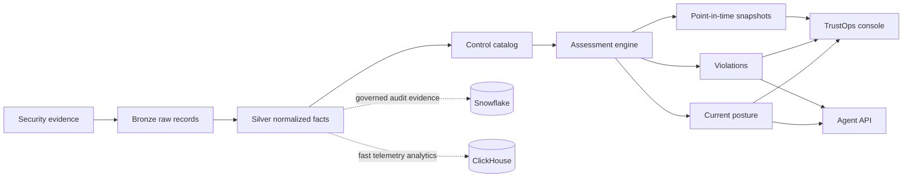

# TrustOps Security Data Lake

Continuous compliance assessment for security data lakes.

It reports near realtime posture with confidence from security evidence,
control tests, owner workflows, snapshots, and agent-readable APIs.


## What This Is

TrustOps is an assessment layer, not just an ingestion demo.

It can run in two modes:

| Mode | Use when | What it does |
|---|---|---|
| Existing lake mode | You already have Snowflake, ClickHouse, object storage, SIEM, scanners, or GRC exports | Reads normalized evidence and evaluates posture |
| Managed evidence mode | You need a local proof-of-value first | Creates bronze, silver, gold, mart, API, dashboard, and snapshots |

## Product Surface

| Surface | Human workflow | Agent workflow |
|---|---|---|
| Trust dashboard | report current posture, freshness, confidence, and risk | `GET /api/posture/current` |
| Control workbench | inspect tests, owners, evidence, and failures | `GET /api/controls` |
| Violation queue | assign remediation from failing evidence | `GET /api/violations` |
| Evidence room | trace source records, hashes, artifacts, and mappings | normalized JSONL + local SQL mart |
| Snapshot engine | freeze point-in-time posture for audit or vendor review | `POST /api/snapshots` |
| Analyst skills | SOC analyst, SOC 2, AI governance, PCI/ISO expansion guards | skill-pack instructions |

## Live Demo

```bash
python -m venv .venv
source .venv/bin/activate
pip install -e ".[dev]"

security-lakehouse pipeline run \
  --raw data/raw/security_events.jsonl \
  --out build/lakehouse

security-lakehouse serve \
  --lake build/lakehouse \
  --port 8787
```

Open:

```text
http://127.0.0.1:8787/
```

## Assessment Workflow



## Confidence Model

TrustOps separates readiness from confidence.

| Metric | Meaning |
|---|---|
| Readiness score | How many implemented control tests are passing |
| Posture confidence | How much trust to place in the reported posture |
| Evidence freshness | Latest event time and source availability |
| Evidence coverage | Controls with linked evidence |
| Snapshot hash | Immutable assessment hash for point-in-time reporting |

This matters because a company can be failing controls and still have high
confidence in the report. That is useful: leadership sees the true posture,
owners get a clear remediation queue, and auditors get traceable evidence.

## Data Store Choices

TrustOps separates product logic from storage.

| Store | Role | Status |
|---|---|---|
| Snowflake | governed evidence lake, audit views, retention, RBAC, executive reporting | production hero path |
| ClickHouse | high-volume telemetry, runtime events, trends, fast aggregations | production hero path |
| DuckDB | local analytical lakehouse file for columnar demos and bigger local datasets | recommended next local mart |
| SQLite | zero-dependency local SQL artifact for smoke tests and first-run demos | current lightweight default |

SQLite is not the strategic data lake. It is used because it ships with Python
and makes the project runnable without cloud credentials. For a stronger local
analytics story, DuckDB should be added next while keeping Snowflake and
ClickHouse as the production architecture.

## Implemented Framework Scope

Current implemented controls are intentionally small and source-linked:

| Framework | Status |
|---|---|
| SOC 2-oriented controls | implemented seed controls |
| NIST AI RMF | implemented seed controls |
| PCI DSS | guarded analyst skill only |
| ISO/IEC 27001 | guarded analyst skill only |

PCI DSS and ISO/IEC 27001 controls are not marked implemented until versioned
catalog mappings and regression tests are added.

## Data Model

```text
raw evidence
  -> bronze/raw_events.jsonl          immutable replay + SHA-256
  -> silver/normalized_events.jsonl   canonical security facts
  -> gold/control_posture.jsonl       control test state
  -> gold/asset_risk.jsonl            owner remediation queue
  -> gold/current_posture.json        live posture contract
  -> snapshots/*.json                 point-in-time assessment evidence
  -> mart/security_lakehouse.sqlite   local SQL smoke/demo surface
```

## API

| Route | Purpose |
|---|---|
| `GET /api/healthz` | service status |
| `GET /api/posture/current` | current posture, scores, confidence inputs, violations |
| `GET /api/controls` | control workbench records |
| `GET /api/violations` | open control and asset violations |
| `GET /api/assets` | asset risk queue |
| `POST /api/snapshots` | immutable point-in-time assessment snapshot |

## Commands

```bash
security-lakehouse validate --raw data/raw/security_events.jsonl
security-lakehouse pipeline run --raw data/raw/security_events.jsonl --out build/lakehouse
security-lakehouse assessment status --lake build/lakehouse
security-lakehouse assessment violations --lake build/lakehouse
security-lakehouse assessment snapshot --lake build/lakehouse --reason vendor_due_diligence
security-lakehouse query --lake build/lakehouse "select * from control_posture order by risk_score desc"
```

## Repo Map

```text
src/security_lakehouse/     CLI, pipeline, assessment engine, API, dashboard
data/raw/                   sample security evidence
data/schemas/               raw and normalized JSON schemas
controls/                   versioned implemented control catalog
frameworks/                 source-linked framework registry
deploy/snowflake/           governed evidence lake schema
deploy/clickhouse/          telemetry analytics lake schema
docs/                       architecture, diagrams, data model, product artifacts
agent-skills/               guardrailed analyst skills for humans and agents
tests/                      pipeline, catalog, mapping, and assessment tests
```

## Verification

```bash
make smoke
```

The smoke target validates raw evidence, runs the pipeline, renders the console,
and executes the regression suite.

## Name

Public positioning:

```text
TrustOps Security Data Lake
```

Repository name:

```text
trustops-security-data-lake
```

The product is TrustOps. The architecture is a security data lake assessment
layer with Snowflake and ClickHouse as production storage paths.
