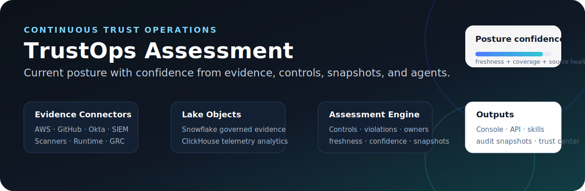
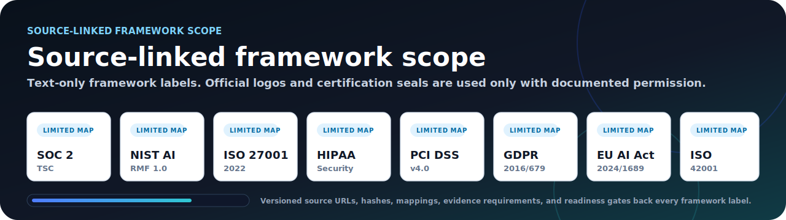
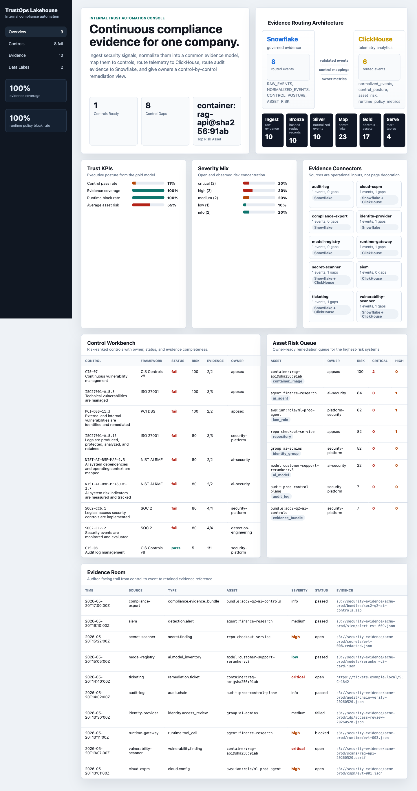
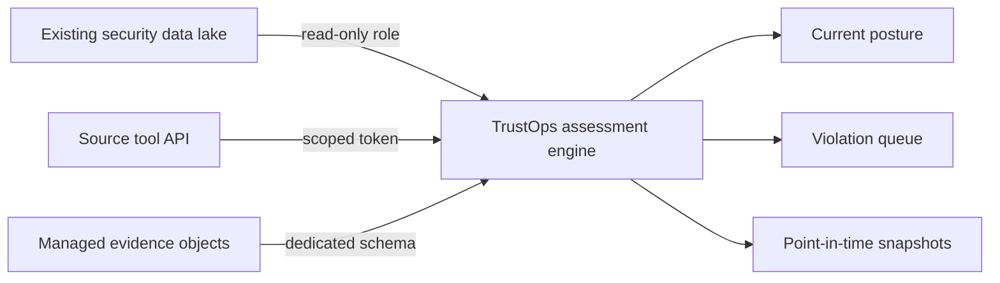
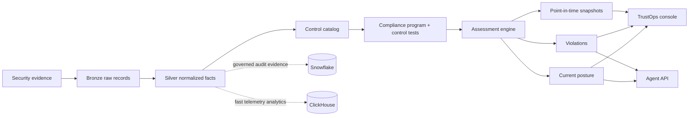
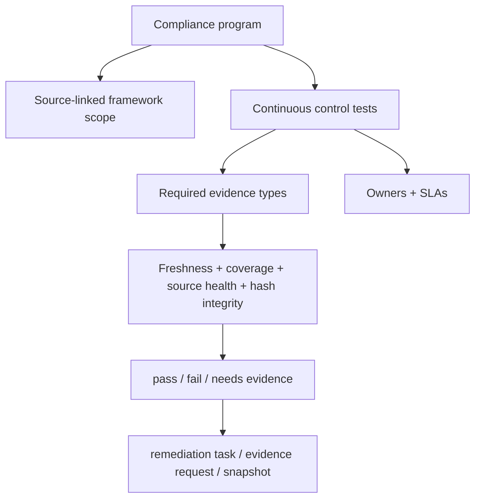

# TrustOps

Self-hosted trust operations for AI-era security teams.

TrustOps turns security evidence into continuous compliance posture, owner
workflows, audit snapshots, repository governance graphs, and agent-readable
APIs while keeping the evidence in your lake or your cloud boundary.

<p align="center">
  
</p>

<p align="center">
  <a href="docs/PRODUCT_WALKTHROUGH.md"><strong>Product walkthrough</strong></a>
  ·
  <a href="docs/FRAMEWORK_COVERAGE.md"><strong>Framework coverage</strong></a>
  ·
  <a href="docs/CONNECTORS.md"><strong>Connectors</strong></a>
  ·
  <a href="docs/SERVER_AUTH.md"><strong>Server auth</strong></a>
  ·
  <a href="docs/api/AGENT_API.md"><strong>Agent API</strong></a>
</p>

<p align="center">
  
</p>

<p align="center">
  
</p>

## What Ships

TrustOps is an assessment platform, not an ingestion demo.

For a concise shipped-versus-planned walkthrough, start with
[Product Walkthrough](docs/PRODUCT_WALKTHROUGH.md).

The current repo includes:

| Layer             | Shipped surface                                                                                                                        |
| ----------------- | -------------------------------------------------------------------------------------------------------------------------------------- |
| Workbench         | Next.js console with dashboard, controls, evidence, violations, workflows, graphs, connectors, frameworks, audit log, and trust center |
| Server mode       | FastAPI behind `.[server]`, API keys, OIDC, SAML, RBAC, request audit events, and tenant/user spine                                    |
| Evidence model    | bronze replay records, silver normalized facts, gold posture/tests/assets/freshness, SQLite/DuckDB local marts                         |
| Continuous inputs | GitHub evidence runner, scheduled connector syncs, public repo audit, authenticated repo governance sync                               |
| Policy logic      | controls-as-code rule engine with lintable evaluation rules and rule reasons in posture output                                         |
| Human + agent API | `/api/v1/*` envelopes plus console-compatible `/api/*`; agents and humans use the same auth boundary                                   |

It can run in two evidence modes:

| Mode                  | Use when                                                                               | What it does                                                      |
| --------------------- | -------------------------------------------------------------------------------------- | ----------------------------------------------------------------- |
| Existing lake mode    | You already have Snowflake, ClickHouse, object storage, SIEM, scanners, or GRC exports | Reads normalized evidence and evaluates posture                   |
| Managed evidence mode | You need a local proof-of-value first                                                  | Creates bronze, silver, gold, mart, API, dashboard, and snapshots |

## Product Surface

| Surface           | Human workflow                                              | Agent workflow                                |
| ----------------- | ----------------------------------------------------------- | --------------------------------------------- |
| Trust dashboard   | report current posture, freshness, confidence, and risk     | `GET /api/posture/current`                    |
| Control workbench | inspect tests, owners, evidence, and failures               | `GET /api/control-tests`, `GET /api/controls` |
| Violation queue   | assign remediation from failing evidence                    | `GET /api/violations`                         |
| Evidence room     | trace source records, hashes, artifacts, and mappings       | normalized JSONL + local SQL mart             |
| Snapshot engine   | freeze point-in-time posture for audit or vendor review     | `POST /api/snapshots`                         |
| Analyst skills    | SOC analyst, SOC 2, AI governance, PCI/ISO expansion guards | skill-pack instructions                       |

Pilot sequencing is tracked in [Pilot Roadmap Tracker](docs/PILOT_ROADMAP.md).

## Connector Access Model

TrustOps uses the smallest viable access boundary:



Preferred order:

1. Read from existing Snowflake, ClickHouse, object storage, SIEM, or scanner evidence.
2. Create managed evidence objects only when the company does not have normalized evidence yet.
3. Use direct tool tokens only when the source system is the evidence authority.

See [Connector And Access Model](docs/CONNECTORS.md).

## Live Demo

```bash
python -m venv .venv
source .venv/bin/activate
pip install -e ".[dev]"

security-lakehouse pipeline run \
  --raw data/raw/security_events.jsonl \
  --out build/lakehouse

security-lakehouse serve \
  --lake build/lakehouse \
  --port 8787
```

Optional local analytical mart:

```bash
pip install -e ".[dev,analytics]"
security-lakehouse pipeline run --raw data/raw/security_events.jsonl --out build/lakehouse
security-lakehouse query --engine duckdb --lake build/lakehouse "select * from control_posture"
```

Validate connector access contracts:

```bash
security-lakehouse connectors validate
security-lakehouse connectors list
security-lakehouse connectors configure \
  --lake build/lakehouse \
  --connector-id github-security \
  --state enabled
security-lakehouse connectors sync \
  --lake build/lakehouse \
  --connector-id github-security \
  --repo OWNER/REPO \
  --fixture-dir tests/fixtures/github-governance
```

Open:

```text
http://127.0.0.1:8787/
```

## Assessment Workflow



## Compliance Program Model

TrustOps now has a first-class program and control-test model.



Each control test has:

| Field                           | Why it matters                                          |
| ------------------------------- | ------------------------------------------------------- |
| `program_id` and `control_id`   | ties posture to a scoped internal compliance program    |
| `required_evidence_types`       | makes evidence collection explicit instead of hand-wavy |
| `result` and lifecycle `status` | separates test outcome from workflow state              |
| `confidence_inputs`             | explains whether the reported posture is trustworthy    |
| `next_action`                   | turns findings into owner work                          |
| `agent_skill`                   | routes headless analysis to the right guarded skill     |

## Confidence Model

TrustOps separates readiness from confidence.

| Metric             | Meaning                                               |
| ------------------ | ----------------------------------------------------- |
| Readiness score    | How many implemented control tests are passing        |
| Posture confidence | How much trust to place in the reported posture       |
| Evidence freshness | Latest event time and source availability             |
| Evidence coverage  | Controls with linked evidence                         |
| Snapshot hash      | Immutable assessment hash for point-in-time reporting |

This matters because a company can be failing controls and still have high
confidence in the report. That is useful: leadership sees the true posture,
owners get a clear remediation queue, and auditors get traceable evidence.

## Data Store Choices

TrustOps separates product logic from storage.

| Store      | Role                                                                      | Status                                      |
| ---------- | ------------------------------------------------------------------------- | ------------------------------------------- |
| Snowflake  | governed evidence lake, audit views, retention, RBAC, executive reporting | target production backend                   |
| ClickHouse | high-volume telemetry, runtime events, trends, fast aggregations          | target production backend                   |
| DuckDB     | local analytical file for columnar demos and bigger local datasets        | optional analytical mart via `.[analytics]` |
| SQLite     | zero-dependency local SQL artifact for smoke tests and first-run demos    | current lightweight default                 |

SQLite is not the strategic data lake. It is used because it ships with Python
and makes the project runnable without cloud credentials. DuckDB is the stronger
local analytical path when the optional `analytics` extra is installed.
Snowflake and ClickHouse remain the production architecture.

## Framework Coverage

The repo currently ships **34 source-linked controls** across **8 frameworks**,
with reviewed source mappings for every seeded control. Public-source frameworks
now have a minimum of six mapped controls each.

| Framework family    | Seeded controls | Reviewed mappings |
| ------------------- | --------------: | ----------------: |
| NIST AI RMF         |               6 |                 6 |
| HIPAA Security Rule |               6 |                 6 |
| GDPR                |               6 |                 6 |
| EU AI Act           |               6 |                 6 |
| ISO/IEC 27001       |               3 |                 3 |
| PCI DSS             |               3 |                 3 |
| SOC 2 TSC           |               2 |                 2 |
| ISO/IEC 42001       |               2 |                 2 |

See [Framework Coverage Matrix](docs/FRAMEWORK_COVERAGE.md) for official source
URLs, current coverage, readiness gates, and expansion roadmap.

Framework visuals use neutral text labels unless an official logo/certification
mark is added with documented permission and attribution under the
[Third-Party Asset Policy](docs/THIRD_PARTY_ASSETS.md). Public visibility of a
logo is not the same thing as permission to bundle it or imply certification.

## Data Model

```text
raw evidence
  -> bronze/raw_events.jsonl          immutable replay + SHA-256
  -> silver/normalized_events.jsonl   canonical security facts
  -> gold/control_posture.jsonl       framework and control posture
  -> gold/control_tests.jsonl         program tests, owners, SLAs, confidence
  -> gold/asset_risk.jsonl            owner remediation queue
  -> gold/current_posture.json        live posture contract
  -> snapshots/*.json                 point-in-time assessment evidence
  -> mart/security_lakehouse.sqlite   local SQL smoke/demo surface
  -> mart/security_data_lake.duckdb   optional local analytical mart
```

## API

`/api/v1/*` is the stable headless contract for agents and external clients. It
returns `{data, meta, errors}` envelopes and supports `limit`, `offset`, `sort`,
and field filters on list resources. The unversioned `/api/*` routes remain for
the bundled console and are served by both local mode and server mode.

| Route                         | Purpose                                                   |
| ----------------------------- | --------------------------------------------------------- |
| `GET /api/v1/healthz`         | service status                                            |
| `GET /api/v1/posture/current` | current posture, scores, confidence inputs, violations    |
| `GET /api/v1/control-tests`   | continuous control tests, owners, confidence, next action |
| `GET /api/v1/controls`        | control workbench records                                 |
| `GET /api/v1/violations`      | open control and asset violations                         |
| `GET /api/v1/evidence`        | normalized evidence facts, filterable by field            |
| `GET /api/v1/assets`          | asset risk queue                                          |
| `GET /api/v1/snapshots`       | immutable point-in-time assessment snapshots              |
| `POST /api/v1/snapshots`      | create an immutable point-in-time assessment snapshot     |

Server mode requires auth for non-health `/api/v1/*` and `/api/*` routes. API
keys, OIDC, and SAML all resolve to the same tenant/user/role model. See
[Server Auth](docs/SERVER_AUTH.md).

Example:

```bash
curl -s 'http://127.0.0.1:8787/api/v1/control-tests?result=fail&sort=-confidence_score&limit=10' | jq .
curl -s 'http://127.0.0.1:8787/api/v1/evidence?control_ids=SOC2-CC6.1' | jq .
```

## Commands

```bash
security-lakehouse validate --raw data/raw/security_events.jsonl
security-lakehouse pipeline run --raw data/raw/security_events.jsonl --out build/lakehouse
security-lakehouse assessment status --lake build/lakehouse
security-lakehouse assessment tests --lake build/lakehouse
security-lakehouse assessment violations --lake build/lakehouse
security-lakehouse assessment snapshot --lake build/lakehouse --reason vendor_due_diligence
security-lakehouse query --lake build/lakehouse "select * from control_posture order by risk_score desc"
security-lakehouse repo audit https://github.com/OWNER/REPO --out build/repo-audit.jsonl
GITHUB_TOKEN=... security-lakehouse repo governance-sync OWNER/REPO --out build/repo-governance.jsonl
```

Public repository audit mode works without credentials for public GitHub repos.
It emits normalized raw evidence for metadata, code ownership, security policy,
workflows, manifests, IaC, AI artifacts, and a repo code graph. See
[Public Repository Audit](docs/REPO_AUDIT.md).

Authenticated repository governance sync uses a read-only GitHub token or
fixture bundle for private and organization-only signals: branch protection,
collaborators, teams, workflow permissions, and security settings. See
[Repository Governance Connector](docs/REPO_GOVERNANCE_CONNECTOR.md).

## Repo Map

```text
src/security_lakehouse/     CLI, pipeline, assessment engine, API, dashboard
data/raw/                   sample security evidence
data/schemas/               raw and normalized JSON schemas
connectors/                 source connector and access-boundary catalog
controls/                   versioned implemented control catalog
programs/                   internal compliance program and control-test catalog
frameworks/                 source-linked framework registry
deploy/snowflake/           governed evidence lake schema
deploy/clickhouse/          telemetry analytics lake schema
docs/                       architecture, diagrams, data model, product artifacts
agent-skills/               guardrailed analyst skills for humans and agents
tests/                      pipeline, catalog, mapping, and assessment tests
```

## Verification

```bash
make smoke
```

The smoke target validates raw evidence, runs the pipeline, renders the console,
and executes the regression suite.

## Project Identity

Product:

```text
TrustOps
```

Repository:

```text
trustops-security-data-lake
```

Architecture:

```text
security data lake assessment workbench
```
