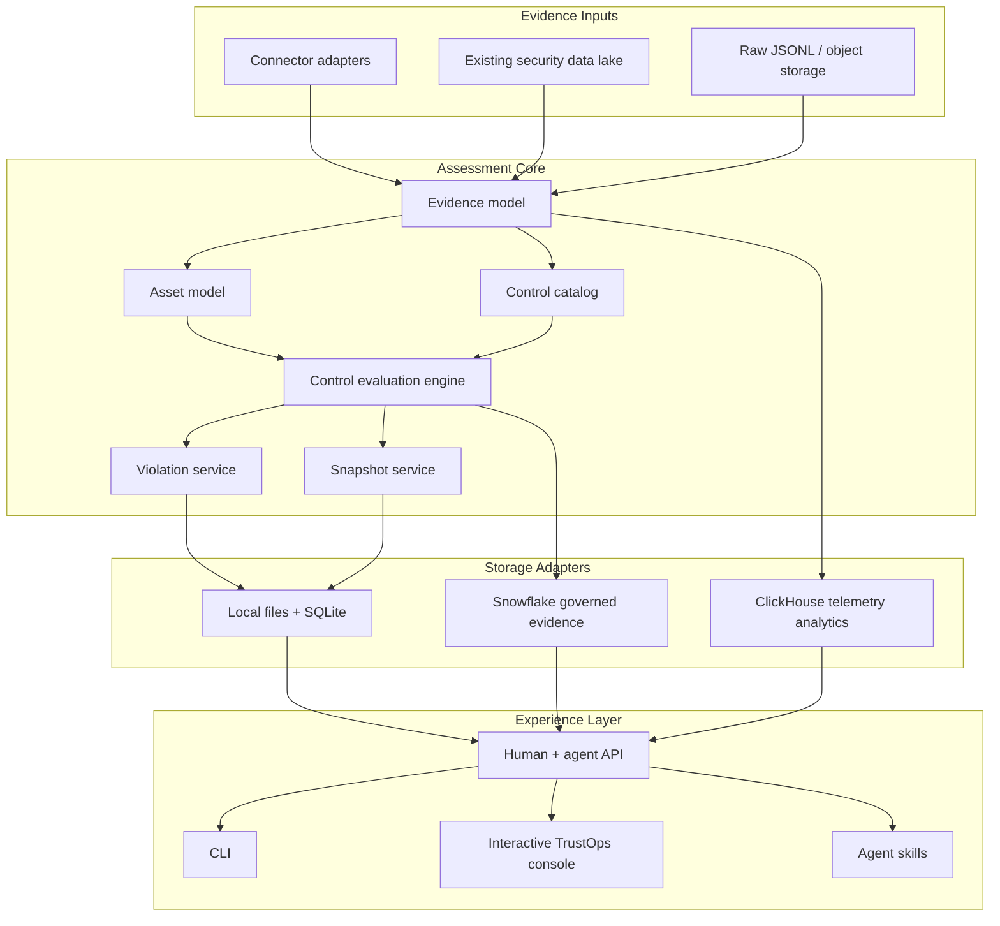

# Architecture

The system is intentionally modular. Ingestion, evidence modeling, control
evaluation, snapshots, lake adapters, API, and UI are separate capabilities with
clear contracts.

## Component Map

## Module Boundaries

| Module | Owns | Does not own |
|---|---|---|
| Connectors | reading evidence from systems | control decisions |
| Evidence model | canonical facts, hashes, freshness | UI state |
| Control catalog | framework/control metadata | raw event parsing |
| Evaluation engine | pass/fail, scores, stale evidence, violations | storage-specific SQL |
| Snapshot service | point-in-time assessment exports | live polling |
| Lake adapters | Snowflake/ClickHouse/local persistence | business rules |
| API | JSON contracts for humans and agents | rendering-only state |
| UI | interactive workflow | control truth |

## Design Rules

- The evaluation engine must run without the UI.
- The UI must consume API/data contracts, not invent posture.
- Connectors may be added without changing controls.
- Controls may be added without changing connectors.
- Snowflake and ClickHouse are adapters, not hard dependencies.
- Point-in-time snapshots must be reproducible from current posture inputs.
