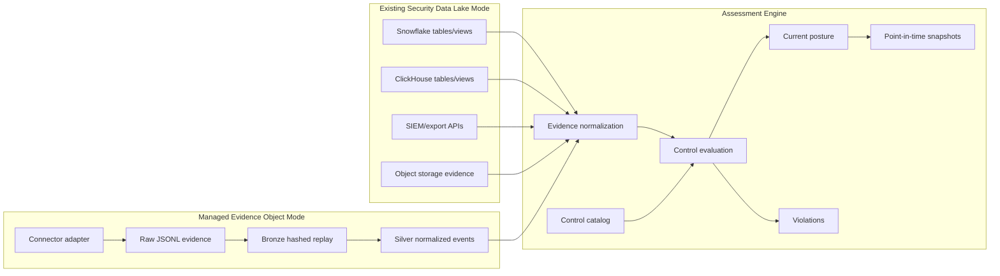

# Data Flow

The product is assessment-first. Data can arrive from an existing security data
lake or from TrustOps-managed connector outputs.

## Two Connection Modes



## Existing Security Data Lake Mode

Use this when the company already has security evidence in Snowflake,
ClickHouse, object storage, a SIEM, or scanner exports.

The tool should:

1. connect read-only to existing tables, views, exports, or files
2. map source fields into the normalized evidence schema
3. evaluate controls without duplicating raw payloads where possible
4. write assessment results, violations, and snapshots to the configured store

This is the lowest-friction enterprise mode because the data stays where the
company already governs it.

## Managed Evidence Object Mode

Use this when the company does not have a clean security data model yet.

The tool creates:

- raw evidence files or landing tables
- bronze hashed replay records
- silver normalized evidence facts
- gold control posture, asset risk, current posture, and snapshots
- optional Snowflake and ClickHouse tables/views

The sample repo implements this locally from `data/raw/security_events.jsonl`.

## Evaluation Steps

```text
source evidence
  -> normalize into canonical evidence facts
  -> join evidence to control mappings
  -> evaluate pass/fail/stale/missing evidence
  -> emit violations with owner, asset, evidence_ref, raw_sha256
  -> compute framework scores and current posture
  -> optionally freeze a point-in-time snapshot
```

## Current Implementation

| Step | Current artifact |
|---|---|
| Source evidence | `data/raw/security_events.jsonl` |
| Validation | `src/security_lakehouse/validation.py` |
| Normalization | `src/security_lakehouse/pipeline.py` |
| Control mapping | `mappings/control_map.json` |
| Assessment engine | `src/security_lakehouse/assessment.py` |
| Current posture | `build/lakehouse/gold/current_posture.json` |
| Violations | `security-lakehouse assessment violations --lake build/lakehouse` |
| Snapshot | `security-lakehouse assessment snapshot --lake build/lakehouse --reason ...` |
| API | `src/security_lakehouse/server.py` |

## Connector Contract

Connectors should emit evidence records with:

- `event_id`
- `tenant_id`
- `event_time`
- `source`
- `event_type`
- `entity.asset_id`
- `entity.asset_type`
- `severity`
- `status`
- `controls`
- `evidence.evidence_id`
- `evidence.uri`
- `evidence.collected_at`

Connectors should not decide compliance. They only collect evidence. The
assessment engine decides posture.

## Evaluation Contract

Controls evaluate from:

- normalized evidence facts
- control mapping metadata
- freshness window
- status/severity rules
- owner and asset context
- exceptions, once implemented

Outputs:

- current posture
- framework scores
- control status
- open violations
- stale controls
- top risk assets
- assessment snapshots
