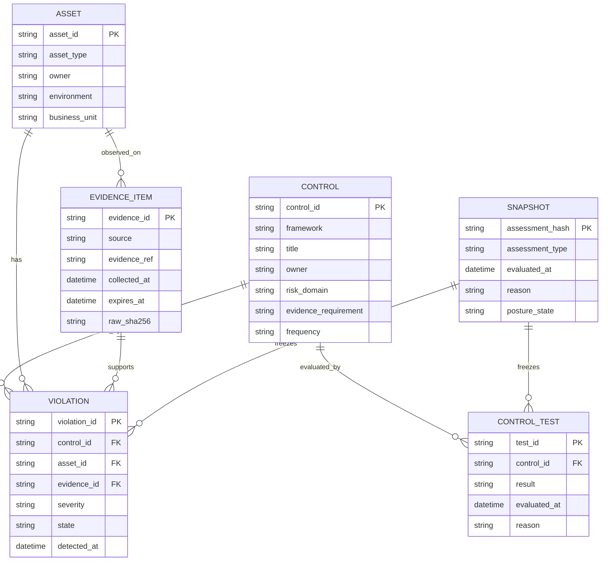

# Data Model

The model separates evidence from evaluation. Evidence describes what was
observed. Assessment describes what that evidence means for controls, risk, and
owners.

## Logical Model

## Physical Tables

| Layer | Table/object | Purpose |
|---|---|---|
| Bronze | `raw_events` | immutable source evidence plus raw hash |
| Silver | `normalized_events` | canonical evidence facts |
| Gold | `control_posture` | current control status and evidence coverage |
| Gold | `asset_risk` | owner-ready risk queue |
| Gold | `current_posture` | live assessment result |
| Gold | `assessment_snapshots` | point-in-time assessment exports |
| API | `/api/posture/current` | current posture contract |
| API | `/api/violations` | open violation contract |
| Catalog | `frameworks/registry.json` | official framework source registry |
| Catalog | `controls/catalog.json` | implemented controls with evidence requirements |

## Schema Contracts

- [Raw security event](../data/schemas/raw-security-event.schema.json)
- [Normalized event](../data/schemas/normalized-event.schema.json)
- [Current posture](../data/schemas/current-posture.schema.json)
- [Violation](../data/schemas/violation.schema.json)
