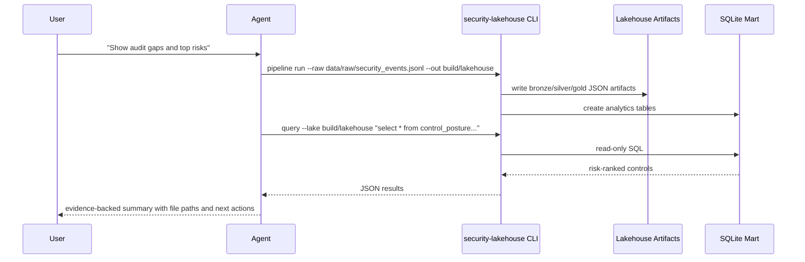

# Agent Workflow

Agents should answer from generated artifacts, not from memory. Every claim in
an agent response should cite one of:

- `build/lakehouse/gold/metrics.json`
- `build/lakehouse/gold/control_posture.jsonl`
- `build/lakehouse/gold/asset_risk.jsonl`
- `build/lakehouse/mart/security_lakehouse.sqlite`
- the raw evidence reference in `evidence_ref`
