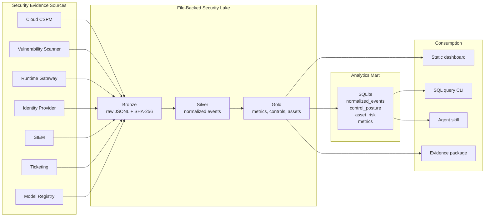

# Architecture — Local (file-backed) mode

TrustOps runs in two modes that share one assessment engine:

- **Local mode** (this diagram): zero-dependency, file-backed Bronze/Silver/Gold
  zones with a SQLite analytics mart and a static dashboard. No cloud account or
  database required; `pip install` and run.
- **Server / warehouse mode**: the same engine behind a FastAPI server with an
  application-state database, RBAC, SSO, the Next.js console, and governed
  evidence in Snowflake or ClickHouse. See
  [`trustops-assessment-architecture.svg`](../images/trustops-assessment-architecture.svg)
  and [`dual-lakehouse.md`](dual-lakehouse.md).

The two are not alternatives to reconcile: local mode is the embedded
single-file path; server mode is the multi-tenant deployment path.

## Why This Design

The pipeline mirrors a real security analytics platform without requiring a
cloud account:

- raw records remain replayable and hash-linked
- transformations are deterministic and testable
- control mappings are separated from source ingestion
- metrics and dashboards are generated from gold data, not hand-written
- SQL access is available through a local mart
