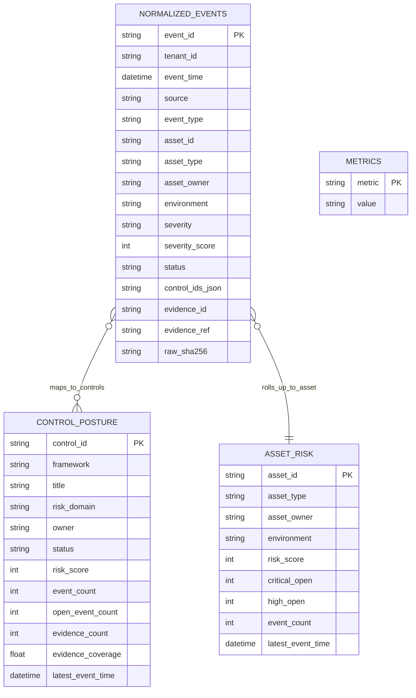

# Data Model

## Canonical Event Fields

| Field | Purpose |
|---|---|
| `event_id` | Source-stable event identifier |
| `tenant_id` | Boundary for multi-tenant analytics |
| `source` | Tool or system that produced the evidence |
| `event_type` | Normalized event family such as `vulnerability.finding` |
| `asset_id` | Canonical asset key for joins and rollups |
| `control_ids` | Framework controls affected by this event |
| `evidence_ref` | Pointer to the retained artifact |
| `raw_sha256` | Replay and tamper-evidence link to bronze data |
