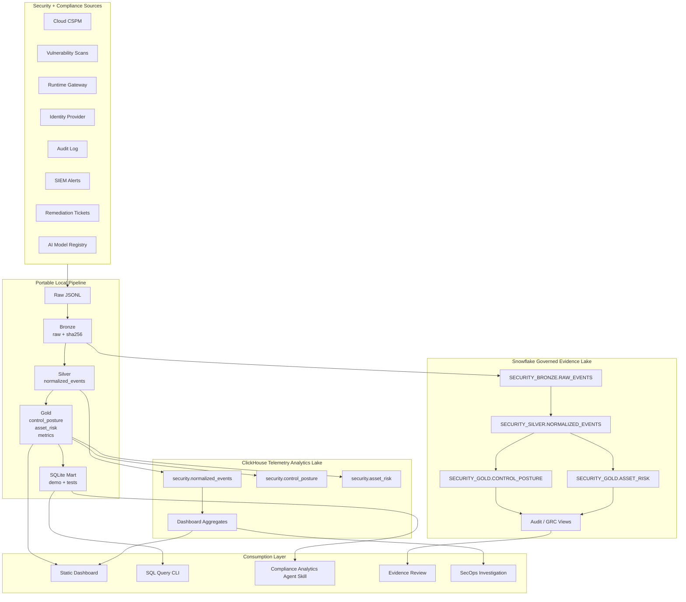

# Dual Lakehouse Architecture

## Backend Split

Snowflake carries the governed evidence story. ClickHouse carries the telemetry
speed story. The local file-backed pipeline proves the transformation and model
without needing either service in an interview.
