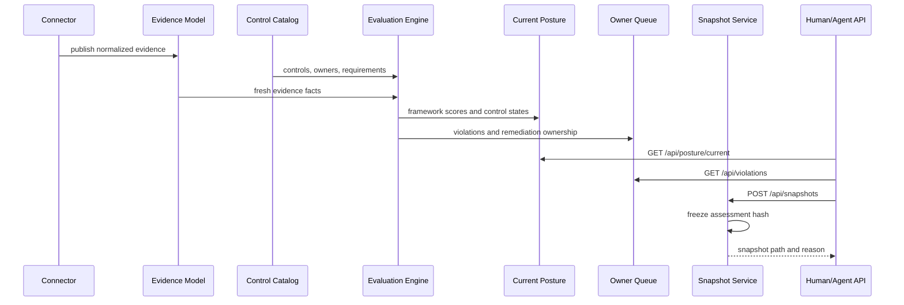

# Evaluation Lifecycle



## Loop

The loop repeats whenever new evidence arrives or control definitions change:

```text
evidence update -> evaluate controls -> update current posture -> notify owners
```

Snapshots are not the normal operating state. They are freeze points for
specific review moments.
