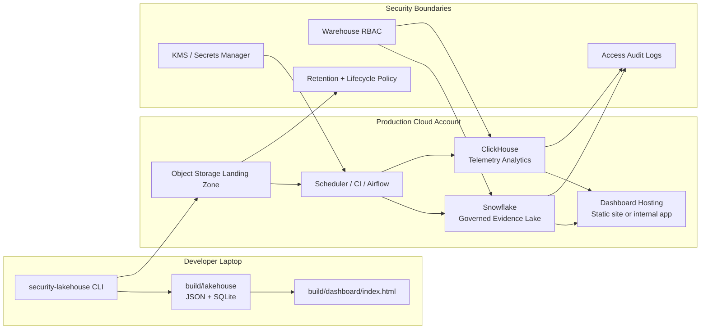

# Hosting Model

## Hosting Notes

- Local mode is dependency-light and interview-friendly.
- Production mode can run from CI, Airflow, Dagster, Prefect, or a Kubernetes CronJob.
- Snowflake credentials should use key-pair or workload identity where possible.
- ClickHouse should use TLS, named users, least-privilege grants, and retention policies.
- Raw payloads can stay in object storage while warehouses retain hashes and evidence pointers.
